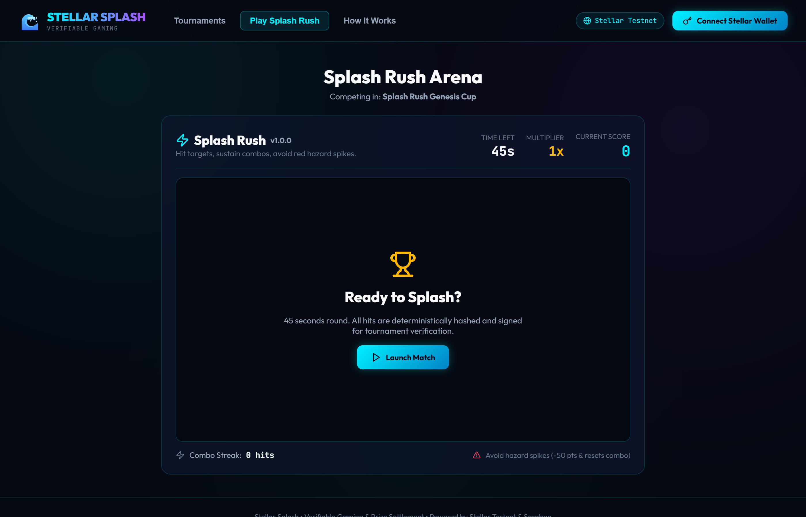
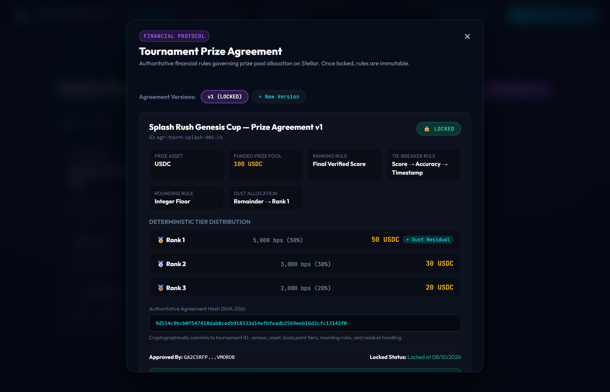
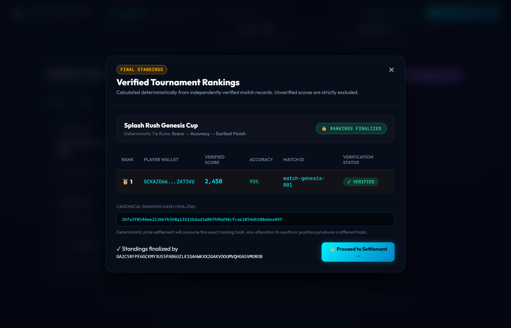
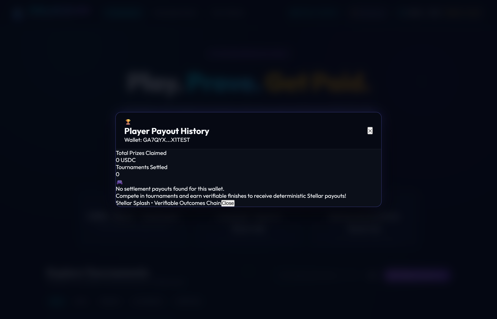

# 🌊 Stellar Splash Engine

> **Backend Engine, Deterministic Game Verifier & Stellar Testnet Indexer**

[](https://stellar.org)
[](https://stellar-splash.netlify.app)
[](https://lab.stellar.org/r/testnet/contract/CACHWJEZY6JN36VFACWRQ7FP4T5EPRRRNBVLOSFHXTJHETZY36JD7QYJ)

The backend orchestration and verification layer for the Stellar Splash gaming platform. It manages tournament lifecycles, issues anti-cheat session tokens, computes deterministic scores from raw game events, verifies real Stellar Testnet funding transactions, and reconciles prize pools against on-chain ledger records.

---

## 🚀 Live Deployments & Network Details

| Resource | Value / Link |
| :--- | :--- |
| **Live Web Application (Netlify)** | [https://stellar-splash.netlify.app](https://stellar-splash.netlify.app) |
| **Soroban Smart Contract** | [`CACHWJEZY6JN36VFACWRQ7FP4T5EPRRRNBVLOSFHXTJHETZY36JD7QYJ`](https://lab.stellar.org/r/testnet/contract/CACHWJEZY6JN36VFACWRQ7FP4T5EPRRRNBVLOSFHXTJHETZY36JD7QYJ) |
| **Stellar Network** | `Stellar Testnet` (Passphrase: `Test SDF Network ; September 2015`) |
| **Horizon RPC** | `https://horizon-testnet.stellar.org` |
| **Soroban RPC** | `https://soroban-testnet.stellar.org` |
| **Contract Explorer** | [View on Stellar Lab](https://lab.stellar.org/r/testnet/contract/CACHWJEZY6JN36VFACWRQ7FP4T5EPRRRNBVLOSFHXTJHETZY36JD7QYJ) |

---

## 📸 Product Operations & Screenshots

### 1. Tournament Indexing & Real-Time Vault Tracking
The engine indexes Stellar ledger transactions to independently verify creator prize deposits before opening tournaments.


---

### 2. High-Frequency Game Event Replay
Replays raw gameplay event streams to detect client score tampering and issue cryptographic match attestations.



---

### 3. Prize Agreement Validation & Basis Points Invariant
Enforces the 10,000 basis points rule ($100.00\%$), integer floor rounding, and dust allocation to Rank 1 before creator approval.



---

### 4. Deterministic Standings & Canonical 32-Byte Ranking Hash
Computes finalized tournament rankings using a 3-tier tie-breaking algorithm and produces a canonical SHA-256 ranking hash.



---

### 5. Multi-Recipient Settlement Execution
Evaluates the 5-point eligibility pipeline, authorizes payout batches, and executes Stellar Testnet transfers with individual receipt tracking.


---

### 6. Player Payout Indexing & Historical Receipts
Provides dedicated REST endpoints for player payout histories, indexing on-chain transactions and verifying accounting reconciliation.



---

## 🏛️ Architecture & Domain Modules

```text
                                  +-----------------------+
                                  |    Express REST API   |
                                  |    & SSE Broadcaster  |
                                  +-----------------------+
                                              |
               +------------------------------+------------------------------+
               |                              |                              |
               v                              v                              v
      +-----------------+            +-----------------+            +-----------------+
      |  Game & Match   |            |   Tournament    |            |   Blockchain    |
      |     Engine      |            |     Engine      |            |     Indexer     |
      +-----------------+            +-----------------+            +-----------------+
      | - Session token |            | - Registration  |            | - Horizon API   |
      | - Event stream  |            | - State machine |            | - Tx validation |
      | - Integer score |            | - Capacity rule |            | - Vault auditor |
      | - Result hash   |            | - Leaderboard   |            | - Reconcile     |
      +-----------------+            +-----------------+            +-----------------+
               |                              |                              |
               +------------------------------+------------------------------+
                                              |
                                              v
                                  +-----------------------+
                                  | Store / Audit Ledger  |
                                  +-----------------------+
```

---

## 📋 REST API Reference

### Tournaments
- `GET /api/tournaments`: List all tournaments and states.
- `GET /api/tournaments/:id`: Fetch specific tournament configuration.
- `POST /api/tournaments`: Create a new tournament (initializes in `FUNDING` state).
- `POST /api/tournaments/:id/join`: Register a player wallet into an open tournament.
- `GET /api/tournaments/:id/leaderboard`: Query live leaderboard distinguishing **Current Score** from **Final Verified Result**.

### Result Verification & Attestations
- `POST /api/verification/match/:id`: Trigger independent replay verification of a completed match.
- `GET /api/verification/match/:id`: Retrieve verification record and signed cryptographic attestation.

### Tournament Rankings
- `GET /api/rankings/:tournamentId`: Retrieve deterministic tournament ranking.
- `POST /api/rankings/:tournamentId/finalize`: Finalize tournament ranking and commit to canonical ranking hash.

### Prize Agreements & Financial Rules
- `GET /api/agreements/:tournamentId`: List all versioned prize agreements for a tournament.
- `GET /api/agreements/:tournamentId/active`: Retrieve active (or `LOCKED`) prize agreement.
- `POST /api/agreements`: Create a new prize agreement version (enforces 10,000 bps rule).
- `POST /api/agreements/:tournamentId/:version/approve`: Creator approves specific agreement version and hash.
- `POST /api/agreements/:tournamentId/:version/lock`: Lock agreement permanently.

### Settlements & Multi-Recipient Payouts
- `GET /api/settlements/:tournamentId/eligibility`: Evaluate strict 5-point settlement eligibility pipeline.
- `GET /api/settlements/:tournamentId/preview`: Preview deterministic basis-point allocations, residual dust handling, and accounting invariants.
- `POST /api/settlements/:tournamentId/authorize`: Cryptographically authorize settlement against exact agreement and ranking commitments.
- `POST /api/settlements/:tournamentId/execute`: Submit multi-recipient Stellar Testnet transfers with real transaction tracking.
- `GET /api/settlements/:tournamentId`: Retrieve settlement record and reconciliation status.
- `POST /api/settlements/:settlementId/reconcile`: Trigger independent verification comparing expected vs observed on-chain allocations.
- `GET /api/settlements/player/:playerWallet`: Retrieve player's historical payouts with explorer links.

### Real-Time Events
- `GET /api/events`: Server-Sent Events (SSE) streaming channel.

---

## 🧪 Testing & Verification

Run the automated test suite covering all modules:

```bash
npm test
```

All 39 unit and integration tests execute cleanly:
- `tournament.test.ts`
- `scoring.test.ts`
- `verification.test.ts`
- `ranking.test.ts`
- `agreement.test.ts`
- `settlement.test.ts`

---

## 💻 Local Setup & Running

```bash
npm install
npm run build
npm start
```
By default, the server listens on `http://localhost:4000`.
